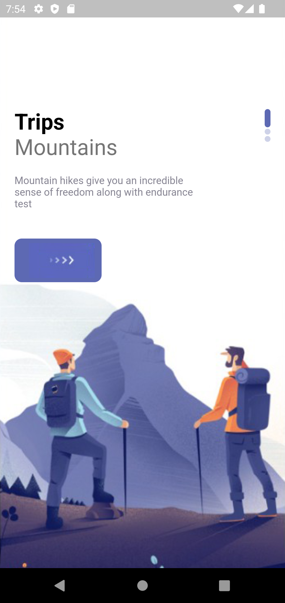
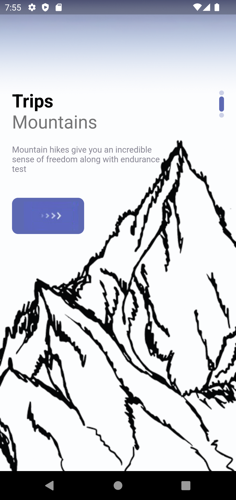
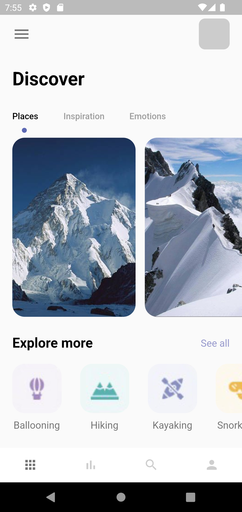
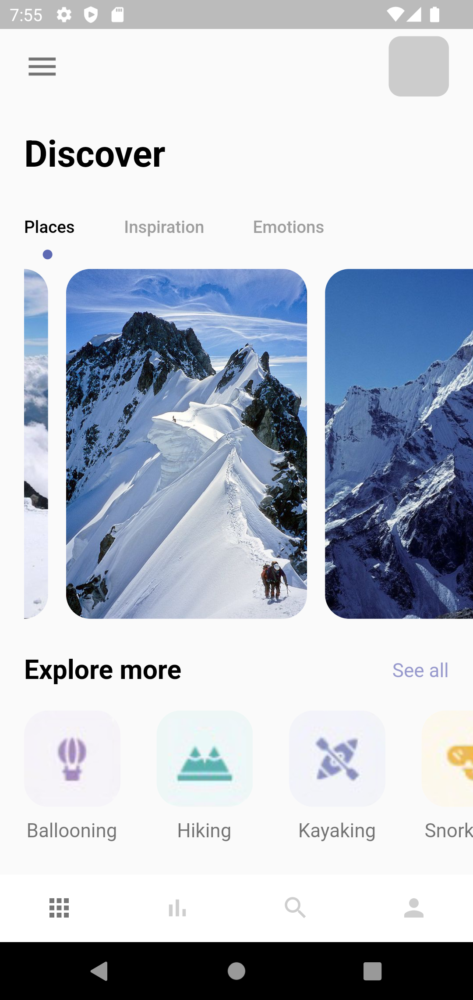
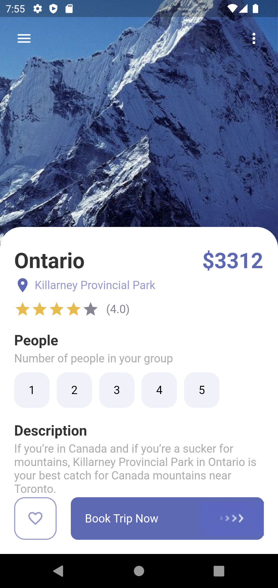

# travel_app

Discover the different locations of the world and various 
information about these locations and the ratings by past visitors.

  
  
  
  
  

A Project Made with Flutter.

State management - [Bloc](https://pub.dev/packages/bloc)

Packages Used
- [Font Awesome](https://pub.dev/packages/font_awesome_flutter)
- [Bloc](https://pub.dev/packages/bloc)
- [Equatable](https://pub.dev/packages/equatable)
- [Http](https://pub.dev/packages/http)
